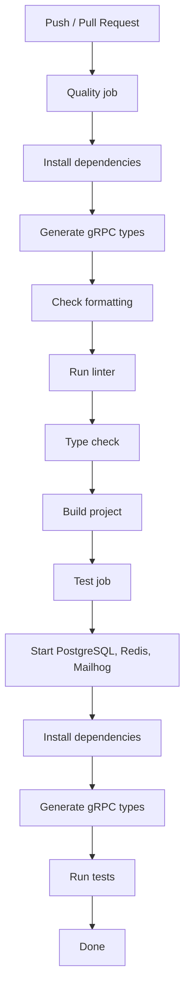

# ADR 0007 - Use GitHub Actions for CI

**Status:** Accepted  
**Date:** 05.05.2026  
**Author:** Volodymyr Kysylenko

---

## Context

The project is hosted on GitHub and requires automated checks on every push and pull request: dependency installation, code generation, formatting, linting, type checking, building, and running unit and integration tests against real infrastructure.

## Decision

Use **GitHub Actions** as the CI platform, with a pipeline structured into two sequential jobs: a **quality** job and a **test** job.

## Pipeline Stages

The test job starts only after the quality job passes, ensuring broken builds do not waste test runner time.

## Consequences

**Positive:**

- Every commit is automatically validated before merge.
- Integration tests run against real database and cache instances, not mocks.
- Pipeline definition lives in the repository and changes are tracked in version history.
- Sequential quality gates reduce the chance of shipping formatting, type, or build regressions into deployment workflows.

**Negative:**

- No automated deployment step (CD) yet, deployment remains manual.
- Execution time is bounded by GitHub-hosted runner performance.
- Security automation is partial until dependency and container vulnerability scanning are enforced in CI.
- Manual release execution keeps higher operational risk than fully automated, approval-gated CD.

## Alternatives Considered

**CircleCI / GitLab CI** - rejected, does not meet project requirements.
