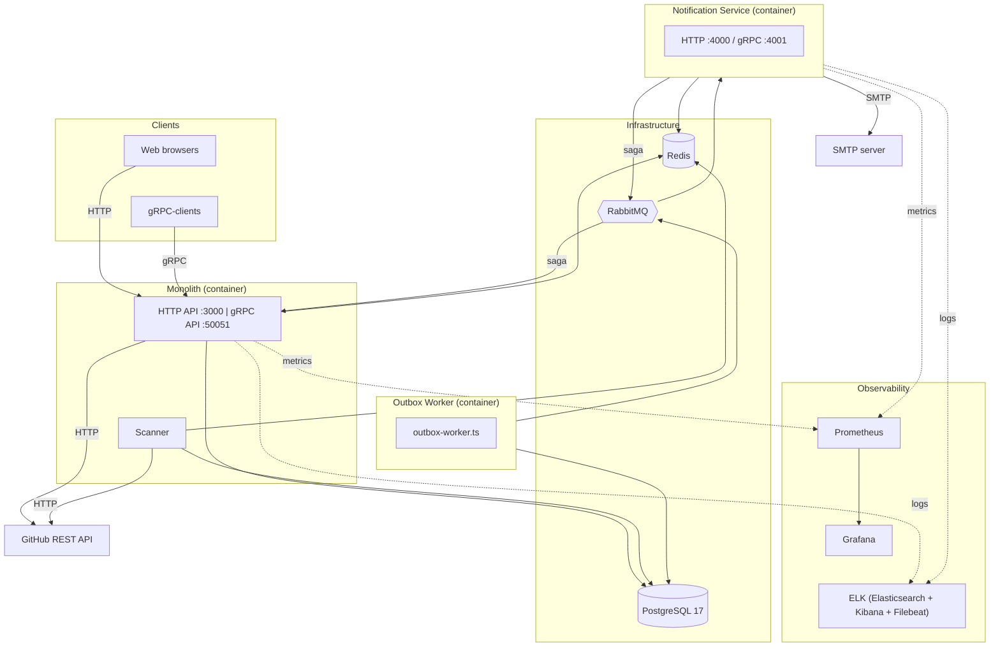
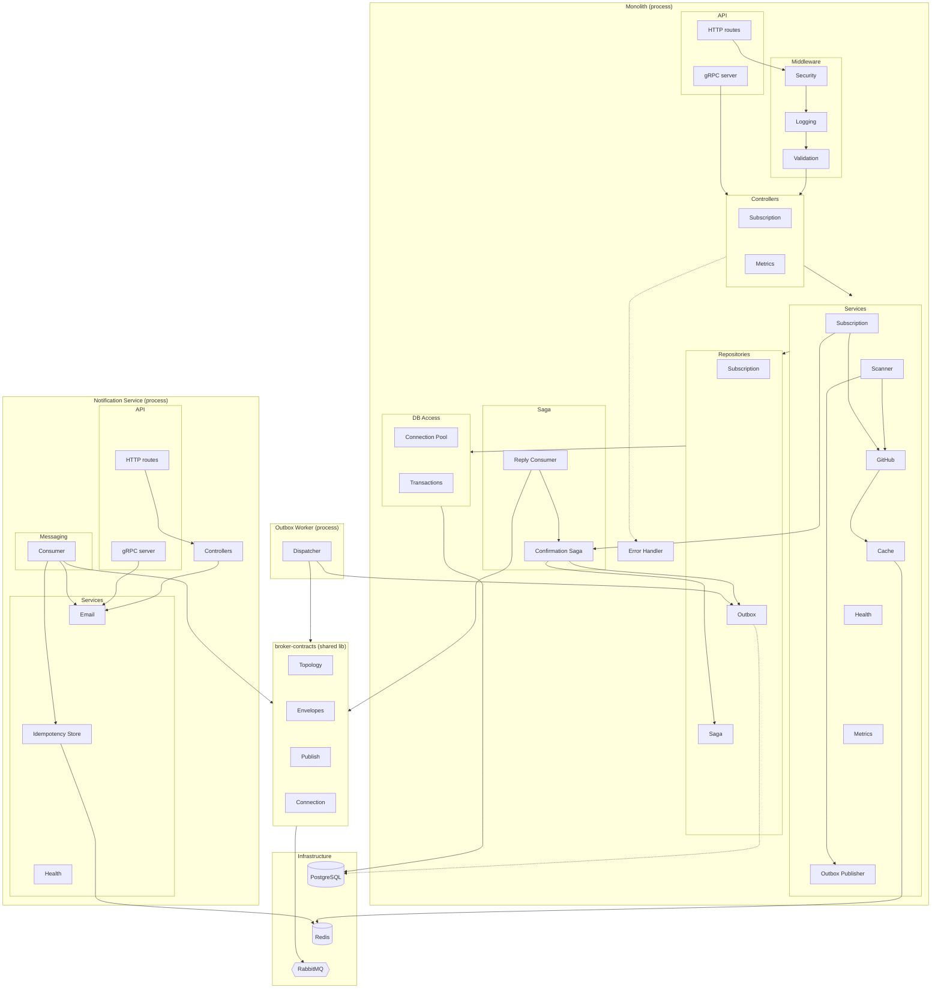

# Application Architecture

This document describes the architecture of **GitHub Release Notifier** – a monorepo
with three deployable units (monolith, notification-service, outbox-worker) and one shared
broker-contracts package.

## 1. High-Level Architecture

The diagram shows the system's main containers, external dependencies, and data flows
between them.

### Description

- **Monolith (`src/`)** serves HTTP and gRPC clients for subscriptions and periodically
  polls GitHub (`Scanner`). When a subscription is created, `App` also calls GitHub –
  it validates that the repository exists and fetches its latest release.
- **Outbox Worker** is a separate container (the `outbox-worker` `docker-compose` service),
  built from the same `src/` but started with a different `node` command
  (`outbox-worker.js`); it only reads the `notification_outbox` table and publishes
  messages to RabbitMQ using publisher confirms.
- **Notification Service** is an independent microservice that consumes email-sending
  commands from RabbitMQ, deduplicates them via Redis (idempotency store), and sends
  emails over SMTP (Nodemailer). It also publishes saga replies (`saga.replies`) back to
  the monolith.
- **PostgreSQL** is the single source of truth for subscriptions and the transactional
  outbox. **Redis** serves two independent roles: a cache for GitHub responses in the monolith, and the delivery idempotency store in notification-service.
  **RabbitMQ** is the asynchronous command/event bus between services.
- Monolith → notification-service interaction happens **exclusively over RabbitMQ**
  (transactional outbox + saga replies). Notification Service additionally exposes direct
  HTTP (`/api/email/*`) and gRPC (`:4001`) endpoints for sending emails, but the monolith's
  current code never calls them – the client code (`src/http-client`,
  `src/grpc/notification.client.ts`) exists but isn't wired up.
- **Prometheus/Grafana** and **ELK** are optional docker-compose profiles (`monitoring`,
  `elk`) for metrics and centralized logging; disabling them doesn't affect the main data
  flow.

## 2. Detailed Architecture – Layered View

The diagram exposes the internal layering of each process
(`routes → controllers → services → repositories → db`) and shows how the shared
`packages/broker-contracts` package is used by both services.

### Description

- **API layer** accepts requests through two parallel interfaces (REST via Express and
  gRPC), which converge at the same controller layer – validation/routing logic
  duplication is factored out into shared DTOs (`dto/subscription.dto.ts`) and
  `grpc/validation.utils.ts`.
- **Business logic layer** encapsulates domain rules: `SubscriptionService` drives the
  subscription lifecycle and delegates sending the confirmation email to the **Saga
  layer**; `ScannerService` detects new releases and writes to the outbox **in the same
  transaction** as the `last_seen_tag` update (an at-least-once guarantee without
  double-sends).
- **Saga layer** implements a choreographed subscription-confirmation saga:
  `subscription-confirmation.saga.ts` creates a correlation record and enqueues a command
  in the outbox; `saga-reply.consumer.ts` listens on the `saga.replies.main` queue and
  marks the saga completed/failed based on notification-service's reply.
- **Repository layer** is the single point of SQL access (`pg`), encapsulating queries and
  the `FOR UPDATE SKIP LOCKED` pattern for safely claiming outbox rows across concurrent
  workers.
- **`error-handler.ts`** – despite being middleware, it's drawn as a standalone node
  outside MW: in the code (`app.ts`) it's mounted last in the stack
  (`app.use(createErrorHandler(...))`) and only actually receives control after the
  controllers (via `next(error)`), so it's logically placed after Controllers rather than
  before them.
- **Outbox Worker** is a separate process (not an under-layer of the monolith, but its own
  container) that only reads `notification_outbox` and publishes to RabbitMQ through the
  shared `publish.ts` library – this decouples message delivery from HTTP/gRPC request
  latency.
- **Notification Service** mirrors the same layered model (API → controllers/services →
  messaging) but adds its own **Messaging layer** – an idempotent consumer with graduated
  retries and a final DLQ after `MAX_DELIVERY_ATTEMPTS`.
- **`packages/broker-contracts`** is a shared "contract" layer that eliminates duplication
  of queue topology and Zod envelope schemas between the monolith and notification-service;
  both services must rebuild this package (`pnpm build:contracts`) after changing it.
