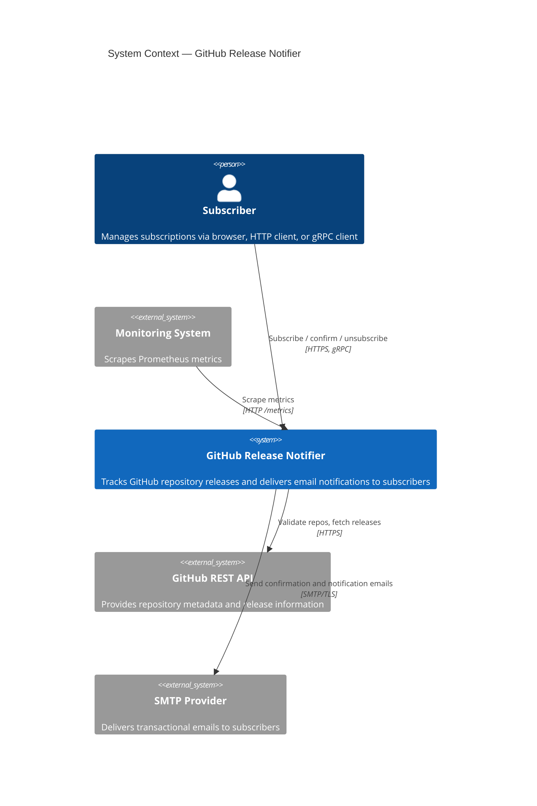
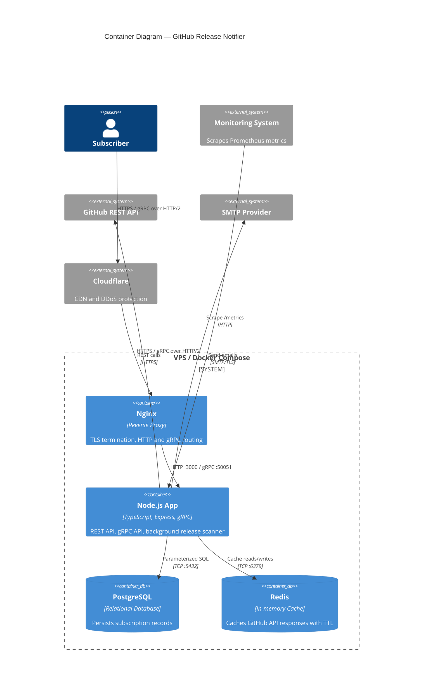
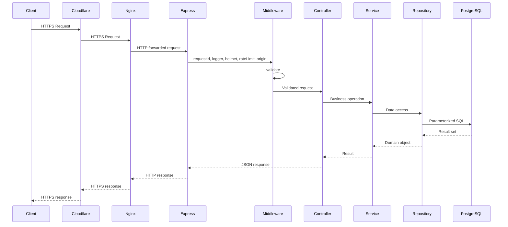
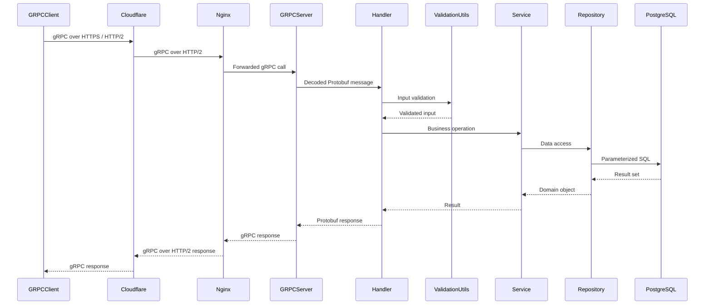
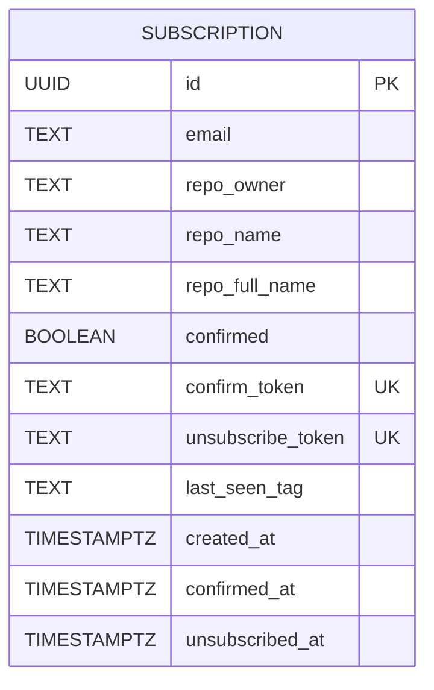
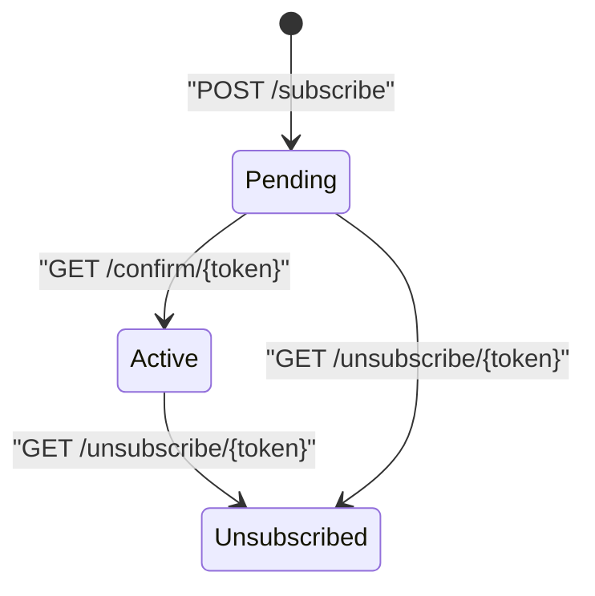
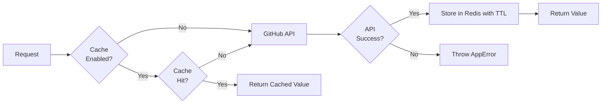
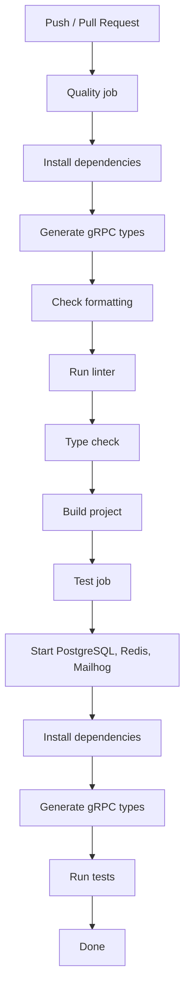
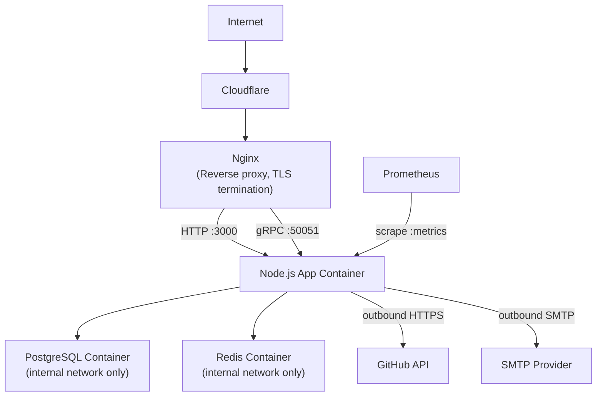

# System Design Document - GitHub Release Notifier

> **Version:** 1.0  
> **Author:** Volodymyr Kysylenko  
> **Status:** Active  
> **Created:** 05.05.2026  
> **Updated:** 08.05.2026

---

## Table of Contents

1. [System Overview](#1-system-overview)
2. [System Requirements](#2-system-requirements)
3. [Load Estimation](#3-load-estimation)
4. [High-Level Architecture](#4-high-level-architecture)
5. [Architecture Style](#5-architecture-style)
6. [Main Components](#6-main-components)
7. [REST API Design](#7-rest-api-design)
8. [gRPC Design](#8-grpc-design)
9. [Database Design](#9-database-design)
10. [Caching Strategy](#10-caching-strategy)
11. [Validation and Error Handling](#11-validation-and-error-handling)
12. [Security Considerations](#12-security-considerations)
13. [Scalability Considerations](#13-scalability-considerations)
14. [Reliability Considerations](#14-reliability-considerations)
15. [Observability and Monitoring](#15-observability-and-monitoring)
16. [CI/CD Pipeline](#16-cicd-pipeline)
17. [Testing Strategy](#17-testing-strategy)
18. [Deployment Architecture](#18-deployment-architecture)
19. [Trade-offs and Limitations](#19-trade-offs-and-limitations)
20. [Future Improvements](#20-future-improvements)

---

## 1. System Overview

**GitHub Release Notifier** is a backend service that allows users to subscribe to GitHub repositories and receive email notifications when a new release is published. Users register by providing their email address and a repository identifier. After confirming ownership of their email via a confirmation link, they receive automatic notifications whenever a watched repository tags a new release on GitHub.

The system exposes a **REST API** for browser-based interactions (web UI and direct HTTP clients), a **gRPC API** for programmatic or service-to-service usage.

A background scanner periodically polls the GitHub API for new releases and sends email notifications. PostgreSQL provides persistent storage, and Redis optionally caches GitHub API responses to stay within GitHub's rate limits.

### Core User Journeys

<table>
    <thead>
        <tr>
            <th>Journey</th>
            <th>HTTP Clients</th>
            <th>Web UI</th>
            <th>gRPC</th>
        </tr>
    </thead>
    <tbody>
        <tr>
            <td>Subscribe to a repository</td>
            <td><code>POST /api/subscribe</code></td>
            <td><code>/</code></td>
            <td><code>Subscribe</code></td>
        </tr>
        <tr>
            <td>Confirm email ownership</td>
            <td><code>GET /api/confirm/:token</code></td>
            <td><code>/confirm/:token</code></td>
            <td><code>Confirm</code></td>
        </tr>
        <tr>
            <td>Unsubscribe from a repository</td>
            <td><code>GET /api/unsubscribe/:token</code></td>
            <td><code>/unsubscribe/:token</code></td>
            <td><code>Unsubscribe</code></td>
        </tr>
        <tr>
            <td>List active subscriptions</td>
            <td><code>GET /api/subscriptions?email=...</code></td>
            <td><code>/subscriptions</code></td>
            <td><code>GetSubscriptions</code></td>
        </tr>
        <tr>
            <td>Receive release notification</td>
            <td colspan="3">
                Automatic, triggered by background scanner
            </td>
        </tr>
    </tbody>
</table>

---

## 2. System Requirements

### 2.1 Functional Requirements

| ID    | Requirement                                                                                                                                  |
| ----- | -------------------------------------------------------------------------------------------------------------------------------------------- |
| FR-1  | A user can subscribe to notifications for any public GitHub repository by providing an email address and repository identifier (owner/repo). |
| FR-2  | The system validates repository existence against the GitHub REST API before creating a subscription.                                        |
| FR-3  | The system sends a confirmation email containing a unique confirmation token after a subscription request is created.                        |
| FR-4  | A subscription becomes active only after successful email confirmation (double opt-in flow).                                                 |
| FR-5  | The system periodically scans GitHub repositories for newly published releases.                                                              |
| FR-6  | When a new release is detected, the system sends notification emails to all active subscribers of the repository.                            |
| FR-7  | Every notification email contains a unique unsubscribe link.                                                                                 |
| FR-8  | A user can unsubscribe without authentication using the unsubscribe token.                                                                   |
| FR-9  | A user can retrieve the list of active subscriptions associated with an email address.                                                       |
| FR-10 | The system exposes both REST and gRPC APIs over the same business logic layer.                                                               |
| FR-11 | The system exposes health and metrics endpoints for operational monitoring.                                                                  |
| FR-12 | The system provides a minimal browser-accessible HTML interface for subscription management.                                                 |

### 2.2 Non-Functional Requirements

| Category        | Requirement                 | Target / Rationale                                                    |
| --------------- | --------------------------- | --------------------------------------------------------------------- |
| Availability    | Service availability        | Best-effort availability for a single-node educational deployment     |
| Latency         | REST API response time      | P95 < 500 ms excluding external API latency                           |
| Scalability     | Active subscriptions        | Support low-to-moderate workloads (~1,000–5,000 active subscriptions) |
| Scalability     | Unique tracked repositories | Support several hundred repositories without architectural changes    |
| Reliability     | Email delivery failures     | Failed email delivery must not terminate scanner execution            |
| Reliability     | Application startup         | Fail-fast if required environment variables are missing or invalid    |
| Security        | Abuse prevention            | Rate limiting and origin validation enabled for public endpoints      |
| Security        | Token safety                | Confirmation and unsubscribe tokens must be cryptographically secure  |
| Security        | Transport encryption        | HTTPS termination at reverse proxy layer                              |
| Maintainability | Logging                     | Structured JSON logs with request correlation                         |
| Maintainability | Validation                  | Centralized schema validation for all external inputs                 |
| Observability   | Metrics                     | Prometheus-compatible metrics endpoint                                |
| Testability     | Automated tests             | Unit and integration test coverage for core flows                     |
| Deployability   | Infrastructure              | Deployable as a single Docker Compose stack                           |

### 2.3 Constraints

| Type              | Constraint                                                                                                               |
| ----------------- | ------------------------------------------------------------------------------------------------------------------------ |
| External API      | GitHub API rate limits apply (60 req/hour unauthenticated, 5,000 req/hour authenticated).                                |
| Infrastructure    | Current deployment is a single VPS instance with no horizontal scaling.                                                  |
| Scanner           | The background scanner currently runs in-process within the application runtime.                                         |
| Database          | PostgreSQL is deployed as a single instance without replication.                                                         |
| Notifications     | Email delivery depends on third-party SMTP provider availability.                                                        |
| Educational Scope | The project prioritizes engineering practices and architectural clarity over enterprise-scale infrastructure complexity. |
| Repository Scope  | Only public GitHub repositories are supported.                                                                           |
| Release Detection | The system relies on polling rather than GitHub webhooks in the current implementation.                                  |

---

## 3. Load Estimation

### 3.1 Expected Usage

The current project is educational and intended for low-to-moderate workloads rather than internet-scale traffic.

| Metric                       | Estimate     | Notes                                              |
| ---------------------------- | ------------ | -------------------------------------------------- |
| Active subscriptions         | ~1,000       | Expected upper bound for educational usage         |
| Unique repositories          | ~200–500     | Multiple subscribers may watch the same repository |
| New subscriptions per day    | ~10–30       | Low daily growth                                   |
| Subscription lookups per day | ~20–50       | Limited user interaction                           |
| Scanner interval             | 5–15 minutes | Configurable interval                              |
| Concurrent API requests      | Low          | Primarily human-driven traffic                     |

### 3.2 GitHub API Load

The scanner groups subscriptions by repository to minimize GitHub API calls.

| Metric                      | Estimate                      |
| --------------------------- | ----------------------------- |
| GitHub API calls per scan   | ~1 call per unique repository |
| Example: 300 repositories   | ~300 API calls per scan       |
| Example: 10-minute interval | ~1,800 API calls/hour         |
| Authenticated GitHub limit  | 5,000 requests/hour           |

The current architecture is intentionally designed to remain within GitHub authenticated API limits under expected educational workloads.

Redis caching additionally reduces repeated repository validation requests and repeated latest-release lookups.

### 3.3 Database Size Estimation

| Entity                   | Estimated Row Size | Estimated Rows | Estimated Size |
| ------------------------ | ------------------ | -------------- | -------------- |
| Subscriptions            | ~400–600 B         | 1,000–5,000    | ~2–3 MB        |
| Metrics / auxiliary data | Negligible         | —              | —              |

The expected database size is small and easily manageable on a single PostgreSQL instance.

### 3.4 Resource Utilization Expectations

| Resource | Expected Usage                                      |
| -------- | --------------------------------------------------- |
| CPU      | Low-to-moderate (primarily I/O-bound workload)      |
| Memory   | < 1 GB application memory under expected load       |
| Network  | Mostly outbound HTTPS (GitHub API) and SMTP traffic |
| Disk     | Minimal growth due to small relational dataset      |

The workload is primarily network-bound rather than CPU-bound because most operations involve external I/O (GitHub API, SMTP, PostgreSQL, Redis).

### 3.5 Bottlenecks

The current architecture is constrained primarily by:

- GitHub API rate limits
- Single-instance scanner execution
- SMTP provider throughput
- Single-node PostgreSQL deployment
- Shared VPS resources between all containers

These constraints are acceptable for the current educational scope and expected workload.

## 4. High-Level Architecture

### System Context (C4 Level 1)



### Containers (C4 Level 2)



---

## 5. Architecture Style

### Monolithic Modular Architecture

The system is implemented as a **single deployable unit** with clear internal module boundaries. This choice was deliberate and fits the scale of this project.

**Why a monolith:**

- **Appropriate for an educational project.** A monolithic architecture makes it easier to learn and apply software engineering best practices, including clean architecture, modular design, validation, testing, CI/CD, observability, and integration patterns, without the additional complexity of distributed systems.
- **No high-load requirements.** The expected usage is limited and predictable, so horizontal scaling, service decomposition, and distributed infrastructure would add unnecessary complexity.
- **Focus on engineering fundamentals.** A monolith allows concentrating on code quality, modular structure, validation, error handling, observability, and deployment practices without the overhead of microservice coordination.
- **Lower operational overhead.** For a learning project, maintaining one deployable unit is more practical than managing multiple services, network boundaries, separate pipelines, and distributed debugging.

The internal structure enforces a **layered separation of concerns**:

```
Routes → Middleware → Controllers → Services → Repositories → Database
```

Each layer has a single responsibility and communicates only with the layer directly below it, making the codebase testable and the boundaries explicit.

### Why Both REST and gRPC

Supporting both **REST** and **gRPC** was part of the project requirements. At the same time, implementing both approaches provides practical experience with different API paradigms and integration patterns.

REST is well suited for browser-based flows, Swagger/OpenAPI documentation, manual testing, and simple external integrations using HTTP and JSON. gRPC is more suitable for service-to-service communication, strongly typed contracts through Protobuf schemas, and more efficient internal integrations with lower serialization overhead.

Using both interfaces also helps better understand API design trade-offs, transport protocols, contract management, and how the same business logic can be exposed through different communication layers.

Both surfaces share the same underlying service and repository layer. The API boundary is purely presentational – no business logic is duplicated.

### Why PostgreSQL

PostgreSQL was used because it was part of the project requirements. For a relatively simple educational project, a lighter database could also be sufficient.

But PostgreSQL provides advantages if the system grows: mature indexing, partial indexes for frequent scanner queries, reliable transactional behavior, extensions such as `pgcrypto`, and good scalability options compared with simpler embedded or lightweight databases.

### Why Redis

Redis was used because it was part of the project requirements. For a simple educational project, a lighter caching solution could also be sufficient, for example an in-process `Map`, `lru-cache`, or `node-cache`. However, Redis provides a more production-oriented caching layer and better represents how caching is commonly handled outside a single application process.

In this project, Redis is used exclusively as a read-through cache for GitHub API responses. GitHub's unauthenticated rate limit is 60 requests/hour per IP, while the authenticated limit is 5,000 requests/hour. Caching repository existence checks and latest release lookups reduces API call frequency and helps avoid rate-limit pressure.

Cache entries have a configurable TTL, so cached data is automatically considered stale after a defined period. After expiry, the system falls back to a live GitHub API call and refreshes the cache.

Redis is optional – the system degrades gracefully to direct API calls when Redis is unavailable or disabled. No functionality is lost.

---

## 6. Main Components

### 6.1 HTTP Layer (`src/app.ts`)

Owns the HTTP surface of the application. It is the only place where cross-cutting concerns — security headers, rate limiting, request identity, origin validation, and body parsing — are wired together, keeping that configuration out of business logic. The application is constructed via a factory function so the same setup can be instantiated in tests without a running server.

### 6.2 gRPC Server (`src/grpc/server.ts`)

Owns the binary-protocol surface of the application. It exists as a separate bootstrap unit because gRPC and HTTP/1.1 require different transport stacks and run on different ports. Its responsibility is to translate incoming Protobuf messages into the same domain calls the REST controllers make; no business logic lives here.

### 6.3 Subscription Service (`src/services/subscription.service.ts`)

The central domain orchestrator and the single module that knows the full lifecycle of a subscription — from initial creation through email confirmation to active monitoring and eventual unsubscription. All API entry points (REST and gRPC) delegate to it, ensuring business rules are enforced in one place regardless of transport.

### 6.4 GitHub Service (`src/services/github.service.ts`)

Isolates all coupling to the GitHub REST API. No other component holds an HTTP client or knows GitHub's response shape. This boundary makes it straightforward to stub the upstream in tests or extend it with webhook support without touching subscription or scanner logic.

### 6.5 Cache Service (`src/services/cache.service.ts`)

Abstracts the Redis client behind a null-safe interface and makes Redis genuinely optional: if the connection is unavailable or disabled, callers receive a cache miss and continue without error. Centralizing this behavior here prevents Redis-specific error handling from leaking into the GitHub service or scanner.

### 6.6 Scanner Service (`src/services/scanner.service.ts`)

Owns the background polling loop. It exists as a separate module because its execution model — periodic, stateful, I/O-intensive — is fundamentally different from request-driven logic. It also holds the in-process mutex that prevents overlapping scan cycles; isolating that coordination concern here keeps it from affecting request-path code.

### 6.7 Email Service (`src/services/email.service.ts`)

Encapsulates all SMTP coupling, retry mechanics, and email templating. Callers (the subscription service and scanner) invoke named operations such as "send confirmation" or "send notification" without any knowledge of the underlying transport, retry strategy, or template rendering.

### 6.8 Metrics Service (`src/services/metrics.service.ts`)

Owns the Prometheus instrumentation registry. Isolating it ensures metric registration and exposition logic does not scatter across services and that the `/metrics` endpoint always reflects a consistent, deduplicated registry. Custom counters and gauges track subscriptions, GitHub API calls, emails, and scanner cycles; default Node.js process metrics are also collected.

### 6.9 Health Service (`src/services/health.service.ts`)

Provides the single authoritative answer to "is the application ready to serve traffic?" by aggregating dependency checks (PostgreSQL, Redis) into one endpoint. Docker Compose's `healthcheck` directive uses this endpoint to gate container restarts and enforce startup ordering.

### 6.10 Repository Layer (`src/repositories/subscription.repository.ts`)

Owns all database access and is the only module that constructs SQL. Its boundary ensures no service or controller holds a database connection or builds a query directly. Raw parameterized SQL is used in place of an ORM for full query visibility; this module is where that trade-off is localized.

---

## 7. REST API Design

All REST endpoints are mounted under the `/api` prefix. Requests and responses use `application/json`. HTML-rendered pages (for browser navigation) are served under the root path `/`.

### Endpoints

| Method | Path                      | Description                         | Auth          |
| ------ | ------------------------- | ----------------------------------- | ------------- |
| `POST` | `/api/subscribe`          | Create a new subscription           | None          |
| `GET`  | `/api/confirm/:token`     | Confirm a subscription              | Token in path |
| `GET`  | `/api/unsubscribe/:token` | Unsubscribe                         | Token in path |
| `GET`  | `/api/subscriptions`      | List subscriptions by email         | None          |
| `GET`  | `/metrics`                | Prometheus metrics scrape endpoint  | Network-level |
| `GET`  | `/api/health`             | Health check (liveness + readiness) | None          |
| `GET`  | `/api-docs`               | Swagger UI (OpenAPI 2.0)            | None          |

### REST Request Lifecycle



### Design Decisions

- **Token-based flows.** Confirmation and unsubscribe operations are stateless and use opaque tokens.
- **No authentication.** The system is intentionally open for subscription creation. Abuse is mitigated by rate limiting, origin validation, and the double opt-in confirmation step.
- **Standard error shape.** All error responses follow a consistent `{ message, code, errors? }` envelope regardless of the error origin (validation, application, or unexpected).

---

## 8. gRPC Design

### 8.1 Proto Schema (`proto/subscription.proto`)

```protobuf
syntax = "proto3";
package subscription;

service SubscriptionService {
  rpc Subscribe(SubscribeRequest) returns (SubscribeResponse);
  rpc Confirm(ConfirmRequest) returns (ConfirmResponse);
  rpc Unsubscribe(UnsubscribeRequest) returns (UnsubscribeResponse);
  rpc GetSubscriptions(GetSubscriptionsRequest) returns (GetSubscriptionsResponse);
}
```

The service exposes the same four core operations as the REST API, enabling programmatic clients to consume the system over HTTP/2 with strongly-typed, binary-encoded messages.

### 8.2 gRPC Request Lifecycle



### Design Decisions

- **Insecure credentials at the application layer.** TLS is not terminated by the gRPC server itself, it is handled upstream by Nginx.
- **Shared service layer.** gRPC handlers delegate to the same service classes as REST controllers. There is no business logic in the transport layer.
- **Input validation in handlers.** The validation module performs structural validation on incoming Protobuf messages before passing them to services, mirroring the Zod middleware used in the REST path.
- **Error mapping.** `AppError` instances are translated to appropriate gRPC status codes.
- **Generated types.** TypeScript types for the gRPC service and messages are generated from the `.proto` file and stored in `src/grpc/generated/`, ensuring type safety across the gRPC boundary.

---

## 9. Database Design

### 9.1 Logical Model

The current version of the system uses a simple relational model with one main entity: `Subscription`.

A subscription represents a user’s request to receive notifications about releases in a specific GitHub repository.



### 9.2 Physical Schema

The current physical schema uses a single PostgreSQL table: `subscriptions`.

```sql
CREATE TABLE subscriptions (
  id                UUID PRIMARY KEY DEFAULT gen_random_uuid(),
  email             TEXT NOT NULL,
  repo_owner        TEXT NOT NULL,
  repo_name         TEXT NOT NULL,
  repo_full_name    TEXT NOT NULL,
  confirmed         BOOLEAN NOT NULL DEFAULT FALSE,
  confirm_token     TEXT NOT NULL UNIQUE,
  unsubscribe_token TEXT NOT NULL UNIQUE,
  last_seen_tag     TEXT,
  created_at        TIMESTAMPTZ NOT NULL DEFAULT NOW(),
  confirmed_at      TIMESTAMPTZ,
  unsubscribed_at   TIMESTAMPTZ,
  CONSTRAINT subscriptions_email_repo_unique UNIQUE (email, repo_full_name)
);
```

### 9.3 Indexes

| Index                           | Columns                   | Condition                       | Purpose                                           |
| ------------------------------- | ------------------------- | ------------------------------- | ------------------------------------------------- |
| `subscriptions_active_repo_idx` | `repo_full_name`          | `WHERE unsubscribed_at IS NULL` | Optimise scanner query: group active subs by repo |
| `subscriptions_email_idx`       | `email`                   | –                               | Optimise list-by-email queries                    |
| PK                              | `id`                      | –                               | Row lookup by UUID                                |
| Unique                          | `confirm_token`           | –                               | O(1) token lookup at confirmation                 |
| Unique                          | `unsubscribe_token`       | –                               | O(1) token lookup at unsubscription               |
| Unique                          | `(email, repo_full_name)` | –                               | Prevent duplicate subscriptions                   |

### Design Decisions

- **Soft deletes:** Uses `unsubscribed_at` to represent inactive subscriptions and support re-subscription by reactivating an existing record instead of creating duplicates.
- **No ORM.** Raw parameterised SQL is used throughout. This avoids ORM overhead, keeps queries explicit and auditable, and removes an external dependency with its own abstraction layer.
- **`pgcrypto` for UUIDs.** `gen_random_uuid()` generates version-4 UUIDs server-side, avoiding application-side UUID generation and its associated consistency concerns.
- **Migrations.** Schema changes are applied via numbered SQL migration files (`/migrations`) executed at startup by the `migrate.ts` module.

### Subscription States



> {} notation is used instead of :token to avoid Mermaid parser syntax conflicts.

---

## 10. Caching Strategy

Redis is used as a read-through, TTL-based cache for external GitHub API responses. The application never writes through to GitHub – cache entries are populated on cache miss and expire automatically.

### Cached Data

| Cache Key Pattern               | Content                             | TTL                 |
| ------------------------------- | ----------------------------------- | ------------------- |
| `repo_exists:{owner}:{repo}`    | Boolean – repository existence      | `REDIS_TTL_SECONDS` |
| `latest_release:{owner}:{repo}` | Latest release tag, URL, name, date | `REDIS_TTL_SECONDS` |

### Cache Behavior



---

## 11. Validation and Error Handling

### Validation Strategy

All external inputs are validated using **Zod** at two distinct boundaries:

| Boundary            | Mechanism                                                    | Scope                                   |
| ------------------- | ------------------------------------------------------------ | --------------------------------------- |
| Environment startup | `EnvSchema.parse(process.env)`                               | All environment variables at boot time  |
| REST request        | `validateBody`, `validateParams`, `validateQuery` middleware | Request body, path params, query params |
| gRPC request        | `validation.utils.ts` handler helpers                        | Protobuf message fields                 |

Validation failures throw a `ZodError`, which the centralized error handler converts to a structured `400 Bad Request` response.

### Error Taxonomy

The `AppError` class (`src/utils/errors.ts`) models all known failure modes with typed constructors:

| Factory                  | HTTP Status | gRPC Code            | Use Case                                |
| ------------------------ | ----------- | -------------------- | --------------------------------------- |
| `AppError.validation()`  | 400         | `INVALID_ARGUMENT`   | Semantic validation (e.g., repo format) |
| `AppError.notFound()`    | 404         | `NOT_FOUND`          | Token not found, repo not found         |
| `AppError.conflict()`    | 409         | `ALREADY_EXISTS`     | Duplicate subscription                  |
| `AppError.rateLimited()` | 429         | `RESOURCE_EXHAUSTED` | GitHub rate limit exceeded              |
| `AppError.external()`    | 502         | `UNAVAILABLE`        | GitHub API / SMTP failures              |
| `AppError.internal()`    | 500         | `INTERNAL`           | Unexpected server errors                |

### Error Handler

The Express error handler (`src/middleware/error-handler.ts`) intercepts all thrown errors and:

1. Converts `ZodError` → 400 with field-level error details.
2. Converts `AppError` → appropriate HTTP status with `{ message, code }` body.
3. Logs 5xx errors at `error` level and 4xx errors at `warn` level.
4. Suppresses noise logging for expected 404 "Route not found" cases.
5. Returns a generic `500 Internal Server Error` for any unrecognized error type, without leaking stack traces.

---

## 12. Security Considerations

### HTTP Security Headers

`helmet` is applied globally to all Express responses.

### Rate Limiting

Rate Limiting enforces a sliding window limit. The limiter uses standard `RateLimit-*` headers and returns a `429` response with a human-readable message when the limit is exceeded.

### Origin Validation

An origin middleware layer validates the `Origin` header of incoming requests against a configurable allowlist. Requests with disallowed origins are rejected before reaching business logic.

### Token Security

- Confirm and unsubscribe tokens are generated with `crypto.randomBytes(24)`, producing a 48-character hex string.

### Secrets Management

- All sensitive configuration (database credentials, SMTP credentials, GitHub token) is injected via environment variables validated by Zod at startup.
- No secrets are committed to the repository. `.env` files are excluded from version control.

### SQL Injection Prevention

All database queries use parameterised statements via the `pg` driver's `$1, $2, ...` placeholder syntax. No string interpolation is used in SQL.

### GitHub Token

The `GITHUB_TOKEN` is optional. When present, it is transmitted as a `Bearer` token in the `Authorization` header over HTTPS to the GitHub API.

### gRPC Transport Security

The gRPC server binds with `ServerCredentials.createInsecure()`. TLS is terminated at the Nginx before traffic reaches the application.

---

## 13. Scalability Considerations

### Current Infrastructure Constraints

The application is currently deployed on a single VPS instance with limited resources:

| Resource     | Available              |
| ------------ | ---------------------- |
| CPU          | 1 vCPU                 |
| RAM          | 2 GB                   |
| Storage      | 20 GB NVMe             |
| Architecture | Single-node deployment |

The infrastructure is intentionally minimal because the project is educational, maintained by a single developer, and does not target high production traffic.

### Current System Constraints

| Resource   | Limiting Factor                                            |
| ---------- | ---------------------------------------------------------- |
| GitHub API | 5,000 req/hour (authenticated), Redis cache mitigates this |
| Scanner    | Single-instance in-process lock, cannot run in parallel    |
| PostgreSQL | Single instance, vertical scaling only in current setup    |
| SMTP       | 2,500 emails/hour                                          |

### Current Scalability Characteristics

The current architecture is sufficient for low-to-moderate workloads and educational usage scenarios. The application is relatively lightweight because:

- Most operations are I/O-bound rather than CPU-intensive.
- Business logic is simple and request throughput is low.
- Redis reduces repeated GitHub API calls.
- The scanner runs periodically rather than continuously.
- PostgreSQL workload is minimal due to the simple model.

However, the current single-node deployment introduces several scalability limitations:

- No horizontal scaling.
- No automatic failover.
- Shared CPU and memory between all containers.
- Limited database throughput.
- Single point of failure.

### Horizontal Scaling Path

The application itself is largely stateless between requests – persistent state is stored in PostgreSQL and Redis.

To support multiple application instances in the future, the following changes would be required:

1. Replace the in-process scanner mutex with distributed coordination (for example Redis distributed locks or PostgreSQL advisory locks).
2. Move PostgreSQL and Redis to dedicated managed or external infrastructure.
3. Introduce load balancing between multiple application containers.
4. Add centralized logging and monitoring for multi-instance observability.

The scanner lock is currently the primary architectural blocker preventing safe horizontal scaling.

No application code changes are required for items 2 and 3. Item 1 is the primary blocker.

### Connection Pooling

PostgreSQL connection pooling is configurable through environment variables:

- `DB_MAX_CONNECTIONS`
- `DB_IDLE_TIMEOUT_MS`
- `DB_CONNECTION_TIMEOUT_MS`

The current configuration is intentionally conservative to avoid exhausting limited VPS resources.

### Resource Allocation

Docker Compose resource limits are configured conservatively to fit within the available VPS capacity.

| Service     | CPU Limit     | Memory Limit |
| ----------- | ------------- | ------------ |
| Application | 0.5-1.0 vCPU  | 512-768 MB   |
| PostgreSQL  | 0.25-0.5 vCPU | 256-512 MB   |
| Redis       | 0.1-0.25 vCPU | 64-128 MB    |

The remaining resources are reserved for the operating system, Docker runtime, reverse proxy, and temporary workload spikes.

---

## 14. Reliability Considerations

### Health Checks

- **Docker Compose healthcheck** polls `GET /api/health` every 30 seconds. Container restarts are triggered after 3 consecutive failures.
- **Application health endpoint** internally checks PostgreSQL connectivity (query roundtrip) and Redis connectivity (ping).
- Dependent services (`db`, `redis`) have their own `healthcheck` directives, and the `app` service declares `depends_on: condition: service_healthy` to prevent startup race conditions.

### Graceful Shutdown

`server.ts` registers handlers for `SIGTERM` and `SIGINT` that:

1. Stop accepting new HTTP connections.
2. Stop the background scanner.
3. Close the Redis connection.
4. Drain the PostgreSQL connection pool.
5. Exit cleanly.

This ensures in-flight requests complete and no database connections are abandoned when a container is stopped.

---

## 15. Observability and Monitoring

### Structured Logging

All application logs are emitted as structured JSON to stdout. Log entries include:

- `level`: `error` | `warn` | `info` | `debug`
- `message`: Human-readable description
- `requestId`: Injected per-request UUID for correlation
- `timestamp`: ISO 8601
- Contextual fields (method, path, status code, duration, error details)

Log verbosity is controlled by `LOG_LEVEL` (default: `info`).

### Metrics

The `/metrics` endpoint serves Prometheus text format. Metrics are collected by the `MetricsService`.

**Custom metrics:**

| Metric                                 | Type    | Labels           |
| -------------------------------------- | ------- | ---------------- |
| `github_notifier_active_subscriptions` | Gauge   | –                |
| `github_notifier_api_calls_total`      | Counter | `status`, `type` |
| `github_notifier_emails_sent_total`    | Counter | `status`         |
| `github_notifier_scanner_runs_total`   | Counter | `status`         |

**Default Node.js metrics**:

- Event loop lag
- Heap memory (used, total, external)
- GC pause duration histogram
- Active handles and requests
- CPU usage

---

## 16. CI/CD Pipeline

The project uses **GitHub Actions** for continuous integration.

### Pipeline Stages



## 17. Testing Strategy

**Vitest** is used for all automated tests, with coverage collected via the V8 provider.

| Test Type         | Location                     | Scope                                                                                                                                         |
| ----------------- | ---------------------------- | --------------------------------------------------------------------------------------------------------------------------------------------- |
| Unit tests        | `src/__tests__/*.test.ts`    | Pure logic: Zod schemas, input validators, scanner grouping and notification eligibility, gRPC validation helpers, cache and metrics services |
| Integration tests | `src/__tests__/integration/` | Full HTTP stack against real PostgreSQL and Redis: subscription lifecycle, conflict handling, health check, rate limiting                     |

Integration tests truncate the `subscriptions` table before each run. Redis is optional — cache-dependent assertions are skipped when `CACHE_ENABLED=false`. SMTP is not exercised in integration tests.

Infrastructure bootstrap files, generated gRPC types, migrations, and config entry points are excluded from coverage.

---

## 18. Deployment Architecture

### Strategy



The application is currently deployed manually to a single VPS server using Docker Compose. This approach was intentionally selected because the project is educational, maintained by a single developer, and does not require complex orchestration infrastructure.

The deployment flow currently consists of:

1. Pulling the latest source code from the repository
2. Building updated Docker images
3. Restarting containers through Docker Compose
4. Running database migrations if required

A fully automated CI/CD deployment pipeline is planned as a future improvement.

### Containerization

The application uses a multi-stage Docker build to reduce production image size and separate build-time dependencies from the runtime environment.

Key containerization decisions:

- Multi-stage build for smaller production images
- Production-only dependency installation
- Non-root container execution
- Explicit health checks
- Isolated internal Docker network for infrastructure services
- Separate runtime and build environments

### Network Isolation

All services communicate through the internal app-network Docker bridge network.

PostgreSQL and Redis are intentionally not exposed to public host ports in production. Only the application container is accessible externally through Nginx, reducing the external attack surface.

### Infrastructure Limitations

The current deployment architecture uses a single VPS instance, which simplifies infrastructure management but introduces several limitations:

- No horizontal scaling
- No automatic failover
- No high-availability database setup
- Manual deployment process
- Limited disaster recovery capabilities

These trade-offs are acceptable for the current educational scope and expected system load.

---

## 19. Trade-offs and Limitations

<table>
    <thead>
        <tr>
            <th>Trade-off</th>
            <th>Current Decision</th>
            <th>Current Consequence</th>
            <th>Possible Future Improvement</th>
        </tr>
    </thead>
    <tbody>
        <tr>
            <td>Monolith vs. microservices</td>
            <td>Monolith</td>
            <td>Simpler operations, harder to scale scanner independently</td>
            <td>Extract scanner or notification delivery into separate services if scaling requirements increase</td>
        </tr>
        <tr>
            <td>Poll-based vs. webhook-based release detection</td>
            <td>Poll (<code>setInterval</code>)</td>
            <td>Configurable delay before notification, additional GitHub API usage</td>
            <td>Add GitHub webhook support for near real-time release detection</td>
        </tr>
        <tr>
            <td>In-process scanner lock</td>
            <td>Boolean mutex</td>
            <td>Cannot safely run multiple app instances without coordination</td>
            <td>Replace with distributed locking or job queue coordination</td>
        </tr>
        <tr>
            <td>No authentication system</td>
            <td>Token-based flows only</td>
            <td>Simpler UX, no account recovery or management interface</td>
            <td>Add optional user accounts and subscription dashboard</td>
        </tr>
        <tr>
            <td>No ORM</td>
            <td>Raw SQL</td>
            <td>Full query control, more boilerplate for complex queries</td>
            <td>Additional refactoring and abstraction layers following SOLID and GRASP principles</td>
        </tr>
        <tr>
            <td>gRPC without mTLS at application layer</td>
            <td>Insecure credentials</td>
            <td>TLS must be enforced at infrastructure level</td>
            <td>Add mTLS or stronger service-to-service security mechanisms</td>
        </tr>
        <tr>
            <td>Redis optional</td>
            <td>Graceful fallback to live API</td>
            <td>Faster consumption of GitHub API rate limits without cache</td>
            <td>Improve caching strategies and cache invalidation mechanisms</td>
        </tr>
        <tr>
            <td>Single <code>subscriptions</code> table</td>
            <td>Flat schema</td>
            <td>Simple structure, denormalised repository metadata</td>
            <td>Normalize repository-related data if the domain model grows</td>
        </tr>
        <tr>
            <td>Email-only notifications</td>
            <td>SMTP email delivery only</td>
            <td>Simplest delivery mechanism, dependency on SMTP provider</td>
            <td>Add webhooks, push notifications, or chat integrations</td>
        </tr>
        <tr>
            <td>Manual deployment</td>
            <td>Manual deployment flow</td>
            <td>More operational steps and higher deployment risk</td>
            <td>Add automated CI/CD deployment pipeline</td>
        </tr>
        <tr>
            <td>Limited observability</td>
            <td>Basic logs and metrics</td>
            <td>Reduced visibility into failures and system health</td>
            <td>Add centralized monitoring, metrics aggregation, and alerting</td>
        </tr>
        <tr>
            <td>No automated backup strategy</td>
            <td>Database persistence only</td>
            <td>Higher recovery risk during infrastructure failures</td>
            <td>Add automated backups and recovery procedures</td>
        </tr>
        <tr>
            <td>Limited infrastructure security automation</td>
            <td>Basic dependency management</td>
            <td>Potential delayed detection of vulnerabilities</td>
            <td>Add dependency auditing and container vulnerability scanning</td>
        </tr>
        <tr>
            <td>Email delivery reliability</td>
            <td>Direct SMTP sending</td>
            <td>Failed deliveries may require manual investigation</td>
            <td>Add retry queues and dead-letter handling</td>
        </tr>
    </tbody>
</table>

---

## 20. Future Improvements

- Further refactor modules according to SOLID and GRASP principles to improve maintainability, reduce coupling, and simplify future feature expansion.
- Add stronger service-to-service security mechanisms such as mTLS for gRPC communication.
- Add an automated deployment pipeline (CD) to reduce manual deployment steps and improve release reliability.
- Implement automated database backup and recovery procedures to improve resilience against data loss and infrastructure failures.
- Introduce centralized monitoring, metrics collection, and alerting to track application health, uptime, resource usage, and failures.
- Support GitHub webhooks in addition to polling to reduce notification latency and API usage.
- Add optional user accounts and a management dashboard for subscription administration.
- Add container vulnerability scanning and dependency auditing to improve infrastructure and supply-chain security.
- Implement retry queues and dead-letter handling for email delivery failures.
